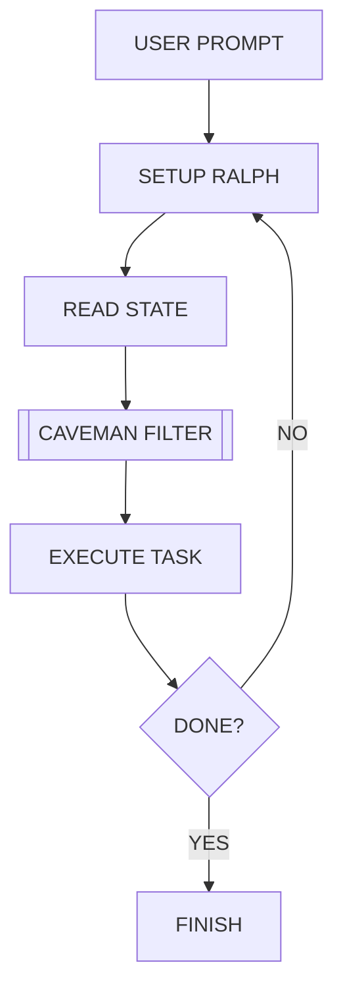

<p align="center">
  
  
</p>

<h1 align="center">🦴 Ralph Caveman</h1>

<p align="center">
  <strong>Persistent iteration. Ultra-terse communication. Maximum efficiency.</strong>
</p>

<p align="center">
  <a href="https://github.com/Ratkiller446/ralph-caveman/stargazers"></a>
  <a href="https://github.com/Ratkiller446/ralph-caveman/commits/master"></a>
  <a href="LICENSE"></a>
</p>

<p align="center">
  <a href="#-lore-the-myth-of-efficiency">Lore</a> •
  <a href="#-features">Features</a> •
  <a href="#-intensity-levels">Levels</a> •
  <a href="#-setup">Setup</a> •
  <a href="#-loop-flow">Flow</a>
</p>

---

**Ralph Caveman** is the hybrid of the [Ralph Wiggum Loop](https://github.com/gemini-cli-extensions/ralph) and the [Caveman Plugin](https://github.com/JuliusBrussee/caveman). It turns your Gemini CLI into an iterative, self-correcting engine that speaks with extreme token efficiency.

```
┌─────────────────────────────────────┐
│  TOKENS SAVED          ████████ 75% │
│  ITERATION SUCCESS     ████████ 100%│
│  WALL OF TEXT REMOVED  ████████ 100%│
│  VIBES                 ████████ OOG │
└─────────────────────────────────────┘
```

## 🦖 Lore: The Myth of Efficiency

Long ago, agents talk much. Wall of text. Many tokens. Much cost. Very slow.
Then came **Ralph**. He iterate. He fail, he loop, he fix. He never stop.
Then came **Caveman**. He drop fluff. He speak true. No "the", no "a", just truth.
Together? **Ralph Caveman**.

> "I iterate, therefore I am terse." — *Ralph the Caveman*

## 🛠️ Features

- **🔄 Persistent Iteration**: Ralph loop logic. If fail, try again. No stop until `DONE`.
- **🪨 75% Token Savings**: Caveman speak. Faster response, lower cost.
- **⚡ Superpowers Ready**: Fully compatible with Brainstorming, Plans, and Debugging skills.

## 🗣️ Intensity Levels

Pick how many grunt you want. Default is `full`.

| Level | Change | Example |
| :--- | :--- | :--- |
| **Lite** | No filler. Pro but tight. | "Component re-renders due to new ref. Use `useMemo`." |
| **Full** | Drop articles. Classic. | "New ref → re-render. Wrap in `useMemo`." |
| **Ultra** | Abbrev everything. Max. | "New ref → re-render. `useMemo`." |
| **Wenyan** | Classical Chinese style. | "物出新參照，致重繪。useMemo 包之。" |

## 🚀 Setup

1. **Get Gemini CLI**: Ensure latest version installed.
2. **Install Extension**:
   ```bash
   gemini extensions install https://github.com/Ratkiller446/ralph-caveman
   ```
3. **Run**:
   ```bash
   /ralph-caveman "build me a world"
   ```

## ⌨️ Commands

| Command | Action |
| :--- | :--- |
| `/ralph-caveman "<prompt>"` | Start iterative terse loop. |
| `/caveman <level>` | Switch intensity (lite, full, ultra). |
| `stop caveman` | Return to verbose talk. |

## 🔄 Loop Flow



## 📜 Law (Apache 2.0)

Copyright 2026 Janne Rovio & JuliusBrussee.
Licensed under the Apache License, Version 2.0. See [LICENSE](LICENSE) for details.

---
<p align="center">
  Made with 🦴 by Janne Rovio
</p>
