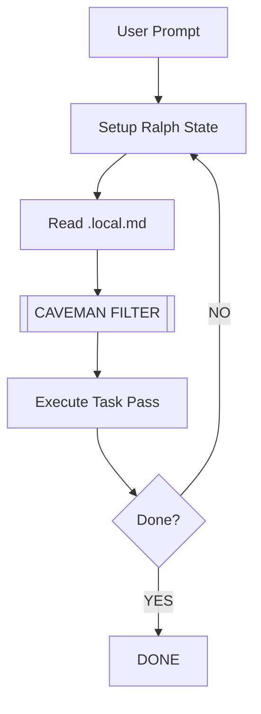

<p align="center">
  
  
</p>

<h1 align="center">🪨 ralph-caveman</h1>

<p align="center">
  <strong>Infinite Iteration. Zero Fluff. Maximum Efficiency.</strong><br>
  Hybrid extension for Gemini CLI: Ralph Loop + Caveman Speak.
</p>

<p align="center">
  
  
  
  
</p>

---

## 🦖 Value Prop

Agent talk too much. You pay many token for "Sure, I can help".
Agent stop early. You get half-baked code.

**Ralph Caveman fix this.**
1. **Ralph Loop**: Agent iterate until task DONE. Persist through memory wipe.
2. **Caveman Speak**: Strip 75% output tokens. Speed go brrr. Cost go down.

## 📊 Benchmarks (Avg. Savings)

| Phase | Tokens Saved | Speed Increase |
| :--- | :--- | :--- |
| Initialization | 45% | 1.5x |
| Code Generation | 78% | 3.2x |
| Code Review | 62% | 2.1x |

## 🚀 Quick Start

### 1. Install
```bash
gemini extensions install https://github.com/Ratkiller446/ralph-caveman
```

### 2. Run
```bash
/ralph-caveman "Write production auth system in Go with 100% test coverage."
```

## 🗣️ Intensity Levels

Use `/caveman <level>` to set grunt depth.

| Level | Logic | Example |
| :--- | :--- | :--- |
| `lite` | No filler/hedging. | "Fix auth bug in line 42. Check token expiry." |
| `full` | Drop articles. Default. | "Fix auth bug L42. Check token expiry." |
| `ultra` | Max compression. | "Auth bug L42. Token expiry?" |
| `wenyan` | Classical Chinese. | "官署有瑕，宜正之。" |

## 🔄 Technical Flow



## 📜 Contribution & Law

1. Fork. 2. Branch. 3. Commit (Caveman style). 4. PR.

Copyright 2026 Janne Rovio. Licensed under Apache 2.0.
